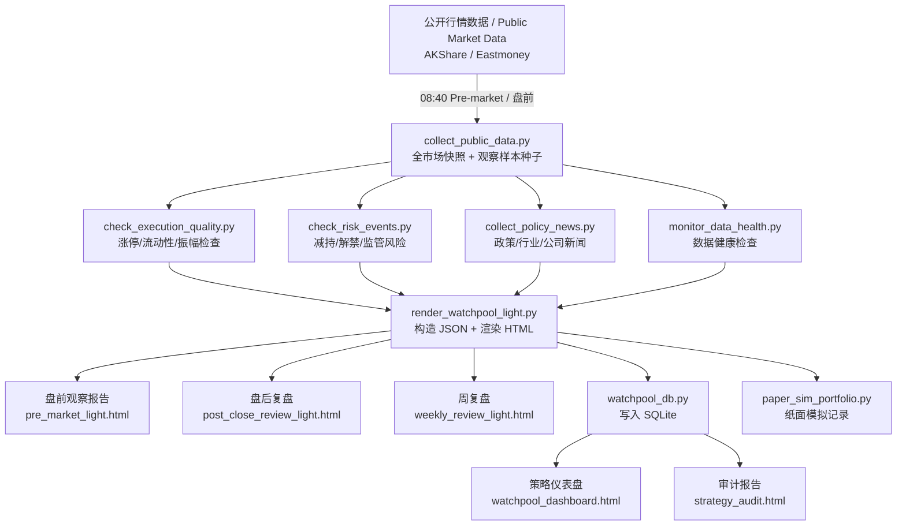

# A股观察池 · A-Share Watchpool

> **[中文]** 基于公开行情数据的 A 股市场研究、纸面模拟与策略审计框架
>
> 本项目仅用于学习、研究、数据管道实验、纸面模拟和策略审计；不构成投资建议，不连接券商接口，不产生真实买卖指令。
>
> **[English]** A public market data research, paper simulation, and strategy audit framework for China A-shares.
>
> This project is designed solely for education, research, data pipeline experiments, paper simulation, and strategy audit. It does NOT constitute investment advice, does NOT connect to brokerage interfaces, and does NOT generate real trading commands.

---

## Quick Navigation / 快速导航

- **English Documents**:
  - [Quick Start Guide](docs/quick-start-en.md)
  - [Watchlist Construction Model Explanation](docs/selection-model-en.md)
  - [Data Sources Explanation](docs/data-sources-en.md)
- **中文文档**:
  - [快速上手指南](docs/quick-start.md)
  - [观察样本构造模型说明](docs/selection-model.md)
  - [数据来源说明](docs/data-sources.md)

---

## 项目简介 / Project Overview

**A股观察池 · A-Share Watchpool** 是一套面向 A 股公开行情数据的轻量级研究框架。项目关注数据采集、观察样本筛选、报告生成、纸面模拟记录与策略审计，帮助研究者在不接入真实交易系统的前提下复现实验流程。

**A-Share Watchpool** is a lightweight research framework targeting China A-share public market data. The project focuses on data collection, watchlist candidate screening, report generation, paper simulation logging, and strategy auditing, helping researchers reproduce experimental workflows without connecting to real trading systems.

### 主要能力 / Key Features:

- **[CN]** 每日采集公开行情快照（沪深京 A 股）并保存运行时数据  
  **[EN]** Collects daily public market snapshots (Shanghai, Shenzhen, and Beijing A-shares) and saves runtime data.
- **[CN]** 基于公开数据构造观察样本（watchlist entries）  
  **[EN]** Constructs watchlist candidates based on public data.
- **[CN]** 汇总政策、行业和公司公开信息，作为研究标签和审计证据  
  **[EN]** Aggregates public policy, industry, and company information as research tags and audit evidence.
- **[CN]** 生成盘前观察报告、盘后复盘报告 and 周度回顾报告  
  **[EN]** Generates pre-market watch reports, post-close review reports, and weekly reviews.
- **[CN]** 使用 SQLite 记录复盘样本，生成策略审计仪表盘  
  **[EN]** Records review samples in SQLite and generates strategy audit dashboards.
- **[CN]** 内置纸面模拟（Paper Simulation），用于记录 T+1/T+2/T+3 的观察结果  
  **[EN]** Built-in Paper Simulation to record and review T+1/T+2/T+3 observation results.

### 核心边界 / Core Boundaries:

- **[CN]** 仅使用公开行情和公开信息源  
  **[EN]** Uses only public market data and open information sources.
- **[CN]** 不连接任何券商接口  
  **[EN]** Does not connect to any broker interfaces.
- **[CN]** 不产生真实买卖指令或自动下单动作  
  **[EN]** Does not generate real buy/sell orders or automatic execution.
- **[CN]** 不承诺收益，不提供荐股、跟单或投资建议  
  **[EN]** Does not guarantee returns, and does not provide stock recommendations or investment advice.
- **[CN]** 输出仅用于学习、研究、数据管道实验、纸面模拟和策略审计  
  **[EN]** Outputs are intended only for education, research, pipeline experiments, paper simulation, and strategy audit.

---

## 系统架构 / System Architecture



---

## 每日 Pipeline 时序 / Daily Pipeline Timeline

| 时间 / Time | Stage | 主要产出 / Key Output |
|-------------|-------|-----------------------|
| 08:40 | `pre_market` | 全市场快照 + 观察样本种子 + 健康检查 / Spot snapshots + watchlist seeds + health check |
| 盘前 / Pre-market | `pre_market` HTML | `pre_market_light.html`（盘前观察报告 / Pre-market watchlist report） |
| 14:45 | `late_confirm` | 纸面模拟记录（仅观察，不实盘 / Paper simulation records, observation only） |
| 15:06 | `post_close` | 收盘快照 + 数据健康 / Post-close snapshot + data health |
| 16:30 | `review_fill` | T+1/T+2/T+3 回顾 + Dashboard 更新 / T+1/T+2/T+3 review + Dashboard updates |
| 盘后 / Post-close | `post_close` HTML | `post_close_review_light.html`（盘后复盘 / Post-close review report） |
| 每周五 / Friday | `weekly` HTML | `weekly_review_light.html`（周复盘 / Weekly review） |

---

## 观察样本构造模型摘要 / Watchlist Construction Model Summary

当前策略版本 / Strategy Version：`a-share-watchpool-v0.9.0` · 模型 / Model：`sector-first-driver-risk-execution-v4`

### 观察池准入门控 / Watchlist Entrance Gates (All constraints must be met)

| 维度 / Dimension | 阈值 / Threshold |
|------------------|------------------|
| 市场情绪分 / Market Emotion Score | >= 50 |
| 板块方向 / Leading Sector | 必须为优先方向 / Must be a priority theme |
| `driver_score`（驱动力） | >= 72 |
| `risk_penalty`（风险扣分） | <= 8 |
| `execution_score`（执行质量） | >= 70 |
| `execution_action` | 必须为 `clear` / Must be `clear` |

### 三档时间维度 / Three-Tier Time Horizons

| 分类 / Classification | 观察周期 / Horizon | 说明 / Description |
|-----------------------|-------------------|-------------------|
| 短周期观察样本 / Short-term | 1-10 交易日 / trading days | 严格观察池样本，需满足全部硬性条件 / Primary watchlist, requires all constraints to pass |
| 中周期趋势观察样本 / Medium-term | 20-60 日 / trading days | 备选推演，条件未全满足时降级 / Downgraded candidates for trend observation |
| 长周期价值线索 / Long-term | 60-240 日 / trading days | 研究线索，不进入短周期观察池 / Long-term value research leads, excluded from primary watchlist |

> 详细模型说明见 / See detailed model docs: [selection-model.md](docs/selection-model.md) / [selection-model-en.md](docs/selection-model-en.md)

---

## 快速上手 / Quick Start

### 1. 克隆仓库 / Clone the Repo

```powershell
git clone https://github.com/hasesc/a-share-watchpool.git
cd a-share-watchpool
```

### 2. 安装依赖 / Install Dependencies

```powershell
pip install -r requirements.txt
```

### 3. 初始化工作空间 / Initialize Workspace

```powershell
New-Item -ItemType Directory -Force -Path @(
  "workspace\data\watchpool",
  "workspace\reports\daily",
  "workspace\reports\dashboard",
  "workspace\reports\health",
  "workspace\logs",
  "workspace\paper-sim\data",
  "workspace\paper-sim\reports"
)
```

### 4. 运行盘前 Pipeline / Run Pre-Market Pipeline

```powershell
$ROOT = (Resolve-Path "workspace").Path
$DATE = (Get-Date -Format "yyyyMMdd")

powershell -File "scripts\run_daily_pipeline.ps1" -Stage pre_market -Root $ROOT -Date $DATE
```

### 5. 查看报告 / View Reports

报告输出到 / Report outputs are saved to `workspace/reports/daily/<yyyymmdd>/pre_market_light.html`，可用浏览器直接打开。

> 详细安装说明见 / See detailed quick start: [quick-start.md](docs/quick-start.md) / [quick-start-en.md](docs/quick-start-en.md)

---

## 目录结构 / Directory Structure

```text
a-share-watchpool/
├── scripts/                   # 核心脚本：数据采集、渲染、审计 / Core pipeline and rendering scripts
├── workspace/                 # 本地运行时模板 / Local runtime template
│   ├── scripts/
│   ├── config/
│   └── paper-sim/             # 纸面模拟 / Paper trading simulator
├── tools/                     # 独立研究工具 / Independent research tools
├── docs/                      # 项目文档 / Project documentation
├── examples/                  # 脱敏示例数据 / Anonymized example data
├── tests/                     # 基础测试 / Test suite
├── requirements.txt
├── LICENSE
├── SECURITY.md
└── DISCLAIMER.md
```

---

## 主要脚本说明 / Main Scripts

| 脚本 / Script | 功能 / Function |
|---------------|-----------------|
| `scripts/collect_public_data.py` | 采集全市场快照、交易日历、K 线历史 / Collect spot data, calendar, and historical K-lines |
| `scripts/check_execution_quality.py` | 涨停板、流动性、振幅等可观察性检查 / Check volatility, turnover, and limit-up status |
| `scripts/check_risk_events.py` | 公告风险扫描（减持、解禁、监管等） / Scan corporate announcement risks (selling, unlock, regulation) |
| `scripts/monitor_data_health.py` | 数据质量健康报告 / Monitor data pipeline quality |
| `scripts/render_watchpool_report.py` | 渲染 HTML 观察报告 / Render HTML watchlist reports |
| `scripts/watchpool_db.py` | SQLite 管理 + 策略仪表盘 / SQLite database management and dashboards |
| `scripts/audit_strategy.py` | 策略证据质量审计（需 >= 20 样本） / Audit strategy performance (requires >= 20 samples) |
| `workspace/scripts/render_watchpool_light.py` | 主报告入口（轻量版） / Entrypoint for rendering lightweight reports |
| `workspace/paper-sim/scripts/paper_sim_portfolio.py` | 纸面模拟记录工具 / Record-only paper portfolio tracking tool |

---

## 独立工具 / Independent Tools

### 基金观察样本筛选 / Fund Screener

```powershell
python tools/screen_a_funds.py
```

**[CN]** 示例筛选条件：近 1 年正收益、最大回撤 <= 20%、排除债基/货币/QDII，输出前 40 个研究样本。该工具仅用于研究样本构造，不构成基金推荐。  
**[EN]** Example filter criteria: positive 1-year return, max drawdown <= 20%, excludes bond/money market/QDII funds, and outputs the top 40 candidates. This tool is for research candidate construction only and does not represent fund recommendations.

### 基金持仓查询 / Fund Holdings Inspector

```powershell
python tools/inspect_fund_holdings.py
```

---

## 数据来源 / Data Sources

本系统使用公开数据接口 / The System uses only public data interfaces:

- [AKShare](https://github.com/akfamily/akshare)：全市场行情快照、K 线历史、交易日历 / Market spot snapshots, K-lines, calendar.
- 东方财富 / Eastmoney：行情备用源 / Fallback quote source.
- 腾讯行情 / Tencent Finance：单个标的价格交叉验证 / Single ticker price cross-validation.

**[CN]** 数据质量取决于第三方公开接口可用性。项目不会上传真实账户数据、交易记录、API key、cookie 或个人身份信息。  
**[EN]** Data quality depends on the availability of third-party interfaces. The project does not collect or upload real brokerage credentials, trading logs, API keys, cookies, tokens, or personal identity data.

---

## 贡献 / Contributing

欢迎提交 Issue 和 PR。请先阅读 [CONTRIBUTING.md](CONTRIBUTING.md)。  
We welcome Issues and PRs. Please read [CONTRIBUTING.md](CONTRIBUTING.md) first.

**[CN]** 适合的贡献包括 bug report、文档改进、公开数据源兼容性改进、测试用例和示例数据。项目不接受真实交易接口、荐股承诺或收益承诺相关贡献。  
**[EN]** Appropriate contributions include bug reports, doc improvements, public data source compatibilities, test cases, and mock examples. The project does not accept brokerage API integrations, stock recommendations, or return promise contributions.

安全问题和敏感数据处理边界见 / For security and data policies, see [SECURITY.md](SECURITY.md).

维护、发布和 issue triage 流程见 / For maintainer playbooks, see [docs/maintainer-playbook.md](docs/maintainer-playbook.md).

版本维护记录见 / For changelogs, see [CHANGELOG.md](CHANGELOG.md).

社区行为准则见 / For code of conduct, see [CODE_OF_CONDUCT.md](CODE_OF_CONDUCT.md).

---

## 许可证 / License

MIT License · 见 / See [LICENSE](LICENSE)

---

## 免责声明 / Disclaimer

本项目仅供学习、研究、数据管道实验、纸面模拟和策略审计使用，不构成投资建议，不连接券商接口，不产生真实买卖指令。详见 [DISCLAIMER.md](DISCLAIMER.md)。  
This project is for education, research, pipeline experiments, paper simulation, and strategy audit only. It does not constitute investment advice, does not connect to broker interfaces, and does not generate real trading commands. See [DISCLAIMER.md](DISCLAIMER.md) for details.
