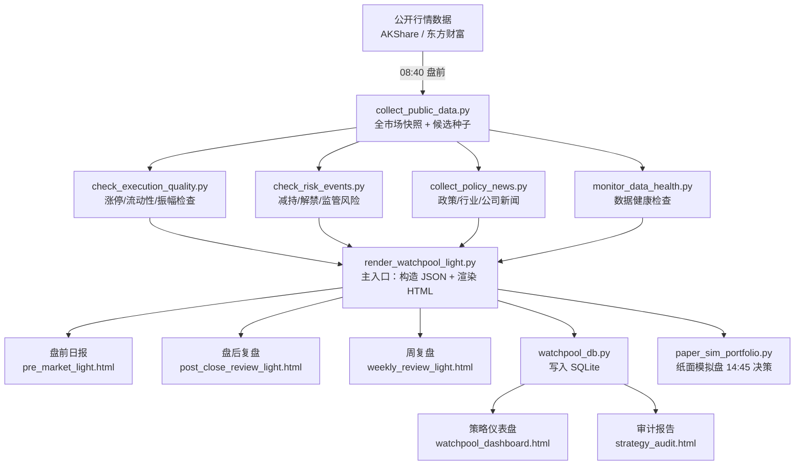

# A股观察池 · A-Share Watchpool

> 基于公开行情数据的 A 股量化观察与纸面验证系统
>
> 仅供个人学习与策略研究，不构成投资建议，不产生真实买卖指令。

---

## 📌 项目简介

**A股观察池** 是一套面向 A 股市场的轻量级量化观察框架，帮助个人投资者/量化爱好者：

- 📊 每日自动采集全市场行情快照（沪深京 A 股，5500+ 标的）
- 🔍 多维度筛选候选股票（动量、板块、执行质量、公告风险）
- 📰 抓取政策/行业/个股新闻催化剂，作为选股辅助信号
- 📈 生成盘前选股日报、盘后复盘报告（HTML 可视化）
- 🗄️ SQLite 复盘数据库 + 策略审计仪表盘
- 🎯 内置纸面模拟盘（Paper Simulator），T+1/T+2/T+3 跟踪验证

### 核心理念

> "先验证，再执行。" 所有选股逻辑在真实资金介入前，先经过至少 20 个有效样本的纸面验证。

---

## 🏗️ 系统架构



---

## 📅 每日 Pipeline 时序

| 时间 | Stage | 主要产出 |
|------|-------|---------|
| 08:40 | `pre_market` | 全市场快照 + 候选种子 + 健康检查 |
| 盘前 | `pre_market` HTML | `pre_market_light.html`（盘前选股日报） |
| 14:45 | `late_confirm` | 纸面模拟盘决策（仅观察，不实盘） |
| 15:06 | `post_close` | 收盘快照 + 数据健康 |
| 16:30 | `review_fill` | T+1/T+2/T+3 回顾 + Dashboard 更新 |
| 盘后 | `post_close` HTML | `post_close_review_light.html`（盘后复盘） |
| 每周五 | `weekly` HTML | `weekly_review_light.html`（周复盘） |

---

## 🔢 选股模型摘要

当前策略版本：`a-share-watchpool-v0.9.0` · 模型：`sector-first-driver-risk-execution-v4`

### 主榜入围硬性条件（全部满足）

| 维度 | 阈值 |
|------|------|
| 市场情绪分 | ≥ 50 |
| 板块方向 | 必须为优先方向 |
| `driver_score`（驱动力）| ≥ 72 |
| `risk_penalty`（风险扣分）| ≤ 8 |
| `execution_score`（执行质量）| ≥ 70 |
| `execution_action` | 必须为 `clear` |

### 三档时间维度

| 分类 | 持仓周期 | 说明 |
|------|---------|------|
| 短线波段候选 | 1–10 交易日 | 严格主榜，需全部硬性条件通过 |
| 中线趋势候选 | 20–60 日 | 备选/推演，条件未全满足时降级 |
| 长线价值线索 | 60–240 日 | 研究线索，不进短线主榜 |

> 详细模型说明见 [docs/selection-model.md](docs/selection-model.md)

---

## 🚀 快速上手

### 1. 安装依赖

```bash
pip install -r requirements.txt
```

### 2. 克隆并初始化工作空间

```bash
git clone https://github.com/your-username/a-share-watchpool.git
cd a-share-watchpool

# 创建运行时目录（数据目录不纳入版本控制）
mkdir -p workspace/data/watchpool workspace/reports/daily workspace/logs
```

### 3. 运行盘前 Pipeline

```powershell
# 修改 ROOT 为你的本地路径，DATE 为目标日期
$ROOT = "D:\your-path\a-share-watchpool\workspace"
$DATE = "20260624"

powershell -File "scripts\run_daily_pipeline.ps1" -Stage pre_market -Root $ROOT -Date $DATE
```

### 4. 查看报告

报告输出到 `workspace/reports/daily/<yyyymmdd>/pre_market_light.html`，用浏览器直接打开。

> 📖 详细安装与配置说明见 [docs/quick-start.md](docs/quick-start.md)

---

## 📁 目录结构

```
a-share-watchpool/
│
├── scripts/                   ← 核心脚本（数据采集、渲染、审计）
│   ├── run_daily_pipeline.ps1 ← Pipeline 总调度
│   ├── collect_public_data.py ← 行情数据采集
│   ├── render_watchpool_report.py ← HTML 渲染引擎
│   ├── watchpool_db.py        ← SQLite + Dashboard
│   ├── audit_strategy.py      ← 策略审计
│   └── ...（共 14 个脚本）
│
├── workspace/                 ← 本地运行时（克隆后在此运行）
│   ├── scripts/
│   │   ├── render_watchpool_light.py  ← 主日报入口
│   │   └── collect_policy_news.py     ← 新闻采集
│   ├── config/
│   │   └── industry_theme_map.json    ← 行业主题映射
│   └── paper-sim/             ← 纸面模拟盘
│       ├── config.json
│       └── scripts/
│           ├── paper_sim_portfolio.py
│           └── paper_sim_strategy_lab.py
│
├── tools/                     ← 独立工具（无需 pipeline 上下文）
│   ├── screen_a_funds.py      ← 基金筛选（收益 + 最大回撤）
│   └── inspect_fund_holdings.py ← 基金持仓查询
│
├── docs/                      ← 文档
│   ├── quick-start.md
│   ├── selection-model.md
│   └── data-sources.md
│
├── requirements.txt
├── LICENSE
└── DISCLAIMER.md
```

---

## 🛠️ 主要脚本说明

| 脚本 | 功能 |
|------|------|
| `scripts/collect_public_data.py` | 采集全市场快照、交易日历、K线历史 |
| `scripts/check_execution_quality.py` | 涨停板/流动性/振幅/追高风险检查 |
| `scripts/check_risk_events.py` | 公告风险扫描（减持、解禁、监管等） |
| `scripts/check_concentration.py` | 候选集行业集中度检查 |
| `scripts/monitor_data_health.py` | 数据质量健康报告 |
| `scripts/render_watchpool_report.py` | 渲染 HTML 日报（纯渲染层） |
| `scripts/watchpool_db.py` | SQLite 管理 + 策略仪表盘 |
| `scripts/audit_strategy.py` | 策略证据质量审计（需 ≥20 样本） |
| `scripts/fill_review_outcomes.py` | T+1/T+2/T+3 结果自动填充 |
| `workspace/scripts/render_watchpool_light.py` | 主日报入口（轻量版，含数据读取+渲染） |
| `workspace/scripts/collect_policy_news.py` | 政策/行业/个股新闻催化剂采集 |
| `workspace/paper-sim/scripts/paper_sim_portfolio.py` | 纸面模拟盘（持仓管理 + 决策） |

---

## 🧰 独立工具

### 基金筛选

```bash
python tools/screen_a_funds.py
```

筛选条件：近 1 年正收益、最大回撤 ≤ 20%、排除债基/货币/QDII，输出前 40 名。

### 基金持仓查询

```bash
python tools/inspect_fund_holdings.py
```

查询指定基金代码的前十大持仓和行业配置。

---

## ⚠️ 数据来源

本系统使用以下公开数据接口：

- **[AKShare](https://github.com/akfamily/akshare)**：全市场行情快照、K线历史、交易日历
- **东方财富**：行情备用源
- **腾讯行情**：单股价格交叉验证

> 所有数据均为公开信息，不使用任何付费或特权数据接口。

---

## 🤝 贡献

欢迎提交 Issue 和 Pull Request！

- **Bug 反馈**：使用 Issue 模板 → Bug Report
- **功能建议**：使用 Issue 模板 → Feature Request
- **代码贡献**：Fork → 新建分支 → PR，请附上简要说明

---

## 📄 许可证

MIT License · 见 [LICENSE](LICENSE)

---

## ⚖️ 免责声明

本项目仅供个人学习与研究，不构成投资建议，不产生真实买卖指令。详见 [DISCLAIMER.md](DISCLAIMER.md)。

**市场有风险，交易需谨慎。**
