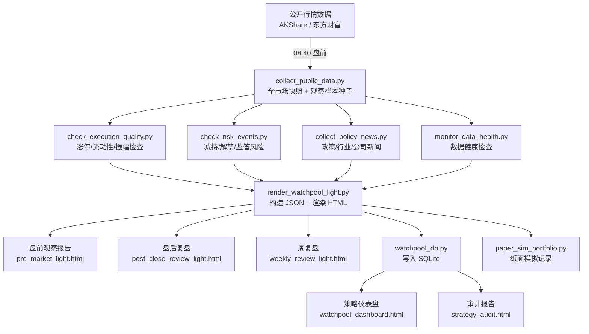

# A股观察池 · A-Share Watchpool

> 基于公开行情数据的 A 股市场研究、纸面模拟与策略审计框架
>
> 本项目仅用于学习、研究、数据管道实验、纸面模拟和策略审计；不构成投资建议，不连接券商接口，不产生真实买卖指令。

---

## 项目简介

**A股观察池 · A-Share Watchpool** 是一套面向 A 股公开行情数据的轻量级研究框架。项目关注数据采集、观察样本筛选、报告生成、纸面模拟记录与策略审计，帮助研究者在不接入真实交易系统的前提下复现实验流程。

English summary: A-Share Watchpool is an open-source research framework for public A-share market data, paper simulation, and strategy audit. It does not connect to brokers, does not place real orders, and is not investment advice.

主要能力：

- 每日采集公开行情快照（沪深京 A 股）并保存运行时数据
- 基于公开数据构造观察样本（watchlist entries）
- 汇总政策、行业和公司公开信息，作为研究标签和审计证据
- 生成盘前观察报告、盘后复盘报告和周度回顾报告
- 使用 SQLite 记录复盘样本，生成策略审计仪表盘
- 内置纸面模拟（Paper Simulation），用于记录 T+1/T+2/T+3 的观察结果

### 核心边界

- 仅使用公开行情和公开信息源
- 不连接任何券商接口
- 不产生真实买卖指令或自动下单动作
- 不承诺收益，不提供荐股、跟单或投资建议
- 输出仅用于学习、研究、数据管道实验、纸面模拟和策略审计

---

## 系统架构



---

## 每日 Pipeline 时序

| 时间 | Stage | 主要产出 |
|------|-------|---------|
| 08:40 | `pre_market` | 全市场快照 + 观察样本种子 + 健康检查 |
| 盘前 | `pre_market` HTML | `pre_market_light.html`（盘前观察报告） |
| 14:45 | `late_confirm` | 纸面模拟记录（仅观察，不实盘） |
| 15:06 | `post_close` | 收盘快照 + 数据健康 |
| 16:30 | `review_fill` | T+1/T+2/T+3 回顾 + Dashboard 更新 |
| 盘后 | `post_close` HTML | `post_close_review_light.html`（盘后复盘） |
| 每周五 | `weekly` HTML | `weekly_review_light.html`（周复盘） |

---

## 观察样本构造模型摘要

当前策略版本：`a-share-watchpool-v0.9.0` · 模型：`sector-first-driver-risk-execution-v4`

### 观察池准入门控（全部满足）

| 维度 | 阈值 |
|------|------|
| 市场情绪分 | >= 50 |
| 板块方向 | 必须为优先方向 |
| `driver_score`（驱动力） | >= 72 |
| `risk_penalty`（风险扣分） | <= 8 |
| `execution_score`（执行质量） | >= 70 |
| `execution_action` | 必须为 `clear` |

### 三档时间维度

| 分类 | 观察周期 | 说明 |
|------|---------|------|
| 短周期观察样本 | 1-10 交易日 | 严格观察池样本，需全部硬性条件通过 |
| 中周期趋势观察样本 | 20-60 日 | 备选推演，条件未全满足时降级 |
| 长周期价值线索 | 60-240 日 | 研究线索，不进入短周期观察池 |

> 详细模型说明见 [docs/selection-model.md](docs/selection-model.md)

---

## 快速上手

### 1. 克隆仓库

```powershell
git clone https://github.com/hasesc/a-share-watchpool.git
cd a-share-watchpool
```

### 2. 安装依赖

```powershell
pip install -r requirements.txt
```

### 3. 初始化工作空间

```powershell
New-Item -ItemType Directory -Force -Path @(
  "workspace\data\watchpool",
  "workspace\reports\daily",
  "workspace\reports\dashboard",
  "workspace\reports\health",
  "workspace\logs",
  "workspace\paper-sim\data",
  "workspace\paper-sim\reports"
)
```

### 4. 运行盘前 Pipeline

```powershell
$ROOT = (Resolve-Path "workspace").Path
$DATE = (Get-Date -Format "yyyyMMdd")

powershell -File "scripts\run_daily_pipeline.ps1" -Stage pre_market -Root $ROOT -Date $DATE
```

### 5. 查看报告

报告输出到 `workspace/reports/daily/<yyyymmdd>/pre_market_light.html`，可用浏览器直接打开。

> 详细安装与配置说明见 [docs/quick-start.md](docs/quick-start.md)

---

## 目录结构

```text
a-share-watchpool/
├── scripts/                   # 核心脚本：数据采集、渲染、审计
├── workspace/                 # 本地运行时模板
│   ├── scripts/
│   ├── config/
│   └── paper-sim/             # 纸面模拟
├── tools/                     # 独立研究工具
├── docs/                      # 项目文档
├── examples/                  # 脱敏示例数据
├── tests/                     # 基础测试
├── requirements.txt
├── LICENSE
└── DISCLAIMER.md
```

---

## 主要脚本说明

| 脚本 | 功能 |
|------|------|
| `scripts/collect_public_data.py` | 采集全市场快照、交易日历、K 线历史 |
| `scripts/check_execution_quality.py` | 涨停板、流动性、振幅等可观察性检查 |
| `scripts/check_risk_events.py` | 公告风险扫描（减持、解禁、监管等） |
| `scripts/monitor_data_health.py` | 数据质量健康报告 |
| `scripts/render_watchpool_report.py` | 渲染 HTML 观察报告 |
| `scripts/watchpool_db.py` | SQLite 管理 + 策略仪表盘 |
| `scripts/audit_strategy.py` | 策略证据质量审计（需 >= 20 样本） |
| `workspace/scripts/render_watchpool_light.py` | 主报告入口（轻量版） |
| `workspace/paper-sim/scripts/paper_sim_portfolio.py` | 纸面模拟记录工具 |

---

## 独立工具

### 基金观察样本筛选

```powershell
python tools/screen_a_funds.py
```

示例筛选条件：近 1 年正收益、最大回撤 <= 20%、排除债基/货币/QDII，输出前 40 个研究样本。该工具仅用于研究样本构造，不构成基金推荐。

### 基金持仓查询

```powershell
python tools/inspect_fund_holdings.py
```

---

## 数据来源

本系统使用公开数据接口：

- [AKShare](https://github.com/akfamily/akshare)：全市场行情快照、K 线历史、交易日历
- 东方财富：行情备用源
- 腾讯行情：单个标的价格交叉验证

数据质量取决于第三方公开接口可用性。项目不会上传真实账户数据、交易记录、API key、cookie 或个人身份信息。

---

## 贡献

欢迎提交 Issue 和 Pull Request。请先阅读 [CONTRIBUTING.md](CONTRIBUTING.md)。

适合的贡献包括 bug report、文档改进、公开数据源兼容性改进、测试用例和示例数据。项目不接受真实交易接口、荐股承诺或收益承诺相关贡献。

---

## 许可证

MIT License · 见 [LICENSE](LICENSE)

---

## 免责声明

本项目仅供学习、研究、数据管道实验、纸面模拟和策略审计使用，不构成投资建议，不连接券商接口，不产生真实买卖指令。详见 [DISCLAIMER.md](DISCLAIMER.md)。
